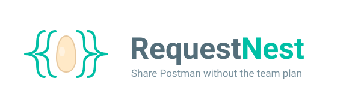

<p align="center">
  
</p>

# RequestNest

**Keep Postman. Skip the per-seat cost. Collaborate through git.**

RequestNest lets a team share Postman collections and environments **for free**
by using a git repo as the shared workspace — so you don't have to migrate to a
different API client *or* pay for a Postman team plan.

Each teammate keeps their own free Postman account. RequestNest syncs each
person's **personal Postman workspace** (via the Postman REST API) with a
**shared git repo** — git is the source of truth, and secrets never land in it.

```
shared git repo  <->  your personal Postman workspace
```

## Why

As of **March 2026**, Postman's free plan is single-user with no shared
workspaces, and team collaboration runs **$23/user/month** (billed monthly; $19
if billed annually). Postman's own native git sync **requires a paid team
workspace** — [it explicitly doesn't work with the personal workspaces free
users have](https://learning.postman.com/docs/agent-mode/native-git).

The other escape hatch is migrating to a git-native client (Bruno, Apidog,
Requestly) — but that means leaving Postman behind. RequestNest is for teams that
want to **stay on Postman**: free accounts *can* use a personal API key against
their personal workspace, so RequestNest publishes your collections to git and
teammates import them into their own workspaces — no migration, no paid seats.
And unlike a raw "commit your exports" workflow, it **sanitizes secrets
automatically** so tokens never reach the repo.

---

## Prerequisites

You need these once, on your machine:

| Requirement | How to get it / check |
|---|---|
| **Python 3.10+** | `python --version` (Windows: install from python.org or `winget install Python.Python.3.12`). |
| **pip** | Ships with Python: `python -m pip --version`. |
| **git** | `git --version`. Set your identity once: `git config --global user.name "You"` and `git config --global user.email you@co`. |
| **A git remote** | A GitHub/GitLab/Bitbucket repo your team can access (this is the "shared workspace"). |
| **A free Postman account** | <https://www.postman.com> — each teammate uses their own. |
| **A Postman API key** | Postman → your avatar → **Settings → API keys** (<https://go.postman.co/settings/me/api-keys>). Generate one; it starts with `PMAK-`. |

> **Mark your secrets in Postman.** For any environment variable that holds a
> token/password, set its **Type = secret** in the Postman UI. RequestNest uses
> that flag to keep the value out of git automatically. (You can also list keys
> under an environment's `secrets:` in config as a backup — see below.)

## Install

Until RequestNest is on PyPI, install from a clone. From the repo root:

```sh
git clone <requestnest repo> && cd requestnest
pip install -e .            # installs the `requestnest` command (alias `rn`)
requestnest --version
```

> **`requestnest` not found after install?** pip installed the command into a
> per-user scripts folder that isn't on your `PATH` (very common on Windows —
> pip prints a `WARNING: The scripts requestnest.exe ... is not on PATH`). You
> have three ways out:

**1. Run it as a module — no PATH change needed (works everywhere):**

```sh
python -m requestnest --version
```

**2. Add the scripts folder to PATH.** It's the folder pip named in its warning.

<details><summary>PowerShell (Windows) — persistent, user-level</summary>

```powershell
# Derive the user scripts folder, then add it to your User PATH (open a NEW terminal after).
$scripts = python -c "import sysconfig; print(sysconfig.get_path('scripts','nt_user'))"
$old = [Environment]::GetEnvironmentVariable("Path", "User")
if ($old -notlike "*$scripts*") {
    [Environment]::SetEnvironmentVariable("Path", "$old;$scripts", "User")
    "Added $scripts to PATH — open a new terminal."
}
```
</details>

<details><summary>Bash / Zsh — add to <code>~/.bashrc</code> or <code>~/.zshrc</code></summary>

```bash
export PATH="$PATH:$(python -c 'import sysconfig; print(sysconfig.get_path("scripts","posix_user"))')"
```
</details>

**3. Use a virtualenv (cleanest for repeat use)** — puts `requestnest` on PATH
automatically whenever the venv is active, and isolates the install:

<details><summary>PowerShell (Windows)</summary>

```powershell
python -m venv .venv
.\.venv\Scripts\Activate.ps1     # if blocked: Set-ExecutionPolicy -Scope CurrentUser RemoteSigned
pip install -e .
```
</details>

<details><summary>Bash / Zsh</summary>

```bash
python -m venv .venv
source .venv/bin/activate
pip install -e .
```
</details>

Prefer an isolated *global* install? Use [pipx](https://pipx.pypa.io):
`pipx install -e .` (or `pipx install requestnest` once published) — the command
is always on your PATH, including for the pre-commit hook.

### Set your API key

Easiest: run `requestnest init` (or `setup`) and paste your key when asked — it's
saved to the gitignored `.requestnest.state.yaml`, so you're never asked again.

Prefer not to store it on disk, or running in CI? Set the `REQUESTNEST_API_KEY`
environment variable instead — it takes precedence everywhere:

<details><summary>PowerShell (Windows)</summary>

```powershell
# Current session only:
$env:REQUESTNEST_API_KEY = "PMAK-..."

# Persistent (every new terminal) — open a NEW terminal afterward:
[Environment]::SetEnvironmentVariable("REQUESTNEST_API_KEY", "PMAK-...", "User")
```
</details>

<details><summary>Bash / Zsh</summary>

```bash
# Current session:
export REQUESTNEST_API_KEY="PMAK-..."

# Persistent: add the same line to ~/.bashrc or ~/.zshrc
```
</details>

> Your `PMAK-...` key is itself a secret — never paste it into a committed file.
> The env var and the gitignored state file both keep it out of git.

---

## How to set up a shared repo (best practice)

**Use one repo per team / product area, holding all of its collections and the
environments they share.** Do *not* make a repo per collection.

```
team-apis/                         <- ONE git repo for the whole area
├── .requestnest.yaml              <- tracks all collections + environments
├── .requestnest.secrets.example.yaml
├── collections/
│   ├── orders-api.json
│   ├── billing-api.json
│   └── inventory-api.json
└── environments/
    ├── staging.json
    └── production.json
```

Why one repo:

- **Environments are defined once** and shared by every collection in the repo —
  so `staging`'s secrets live in a single place, not copied N times.
- **One clone, one `setup`, one onboarding** for a new teammate — they get
  everything at once.
- RequestNest already namespaces collections by name inside the repo, so there's
  no collision.

**Split into separate repos only for an access boundary** — git permissions are
per-repo, so a separate repo is how you stop one team from seeing another team's
collections or secrets. If everyone who needs these collections can see the same
repo, keep them together.

For your current project that touches several collections: **one repo, several
files under `collections/`.**

---

## Quickstart

### A) Publisher — you have collections to share

```sh
# 1. Build/clean up your collection(s) and environment(s) in Postman.
#    Mark secret variables as Type = secret.
# 2. Create the shared repo, clone it, cd in.
git clone <shared repo> && cd team-apis

# 3. One-time setup: pick what to track.
requestnest init
#   - paste your Postman API key when asked (saved locally, gitignored)
#   - tick the collections and environments to track

# 4. Publish.
requestnest push
#   -> writes sanitized JSON, commits, and pushes
#   -> prints which SECRET VALUES to hand teammates out-of-band (e.g. 1Password)
```

### B) Consumer — a teammate already shared collections

```sh
git clone <shared repo> && cd team-apis

requestnest setup
#   - paste your Postman API key
#   - imports the collections/environments into YOUR workspace
#   - prompts you for any secret values (get them from a teammate / 1Password)

# You now have everything in Postman. Go work.
```

### Day-to-day loop

```sh
requestnest pull        # start of day: get everyone's latest into your workspace
# ...edit requests in Postman as usual...
requestnest diff        # preview what you changed vs the repo
requestnest push        # share your changes back
```

That's the whole mental model: **edit in Postman, `pull` to receive, `push` to
share.** Git is handled for you.

---

## Commands

| Command | What it does |
|---|---|
| `requestnest init` | One-time setup: track resources (fresh) or join an existing shared config. |
| `requestnest setup` | One-shot consumer onboarding: join + pull + secret prompts. |
| `requestnest push [names...]` | Workspace → git: fetch, sanitize secrets, safety-scan, commit, push. |
| `requestnest pull [names...]` | Git → workspace: pull, restore secrets, import. |
| `requestnest diff [names...]` | Semantic diff between your live workspace and git. |
| `requestnest list` | Tracked resources, whether you've imported them, and secret status. |
| `requestnest status` | Divergence from remote, missing secrets, and the gitignore guard. |
| `requestnest verify` | CI check: committed JSON is normalized and secret-free. |
| `requestnest secrets check` | Verify all required secret values are present locally. |

`[names...]` are the logical resource names (the file stems, e.g. `orders-api`);
omit them to act on everything.

Global flags: `--no-git` (skip all git), `--dry-run` (preview; no writes, API
calls, or commits), `-v/--verbose`. `push` also takes `--allow-unmarked-secrets`
and `--force` (override a conflict).

> **Safe by default.** `diff` and `--dry-run` let you preview before anything
> changes; `push` refuses to commit token-shaped values it isn't sure about; and
> it warns instead of clobbering if the remote moved under you.

---

## How secrets stay safe

1. **Auto-detected** — any Postman variable of Type `secret` is sanitized.
2. **Config override** — extra keys can be forced via an environment's `secrets:` list.
3. **Safety net** — `push`/`verify` refuse token-shaped values (PMAK-, AWS keys,
   JWTs, long hex) that aren't marked secret.

Committed values become `{{key}}` placeholders; real values live only in the
gitignored `.requestnest.secrets.yaml` and are restored on `pull`. The
committed `.requestnest.secrets.example.yaml` lists the required keys (no
values) so a new teammate knows exactly what to ask for.

## Config reference (`.requestnest.yaml`)

```yaml
version: 1
collections:
  - name: orders-api                 # logical name = file stem
    path: collections/orders-api.json
environments:
  - name: staging
    path: environments/staging.json
    secrets: [api_token, signing_key]  # OPTIONAL override; Type=secret is detected automatically
git:
  remote: origin
  branch: main
  auto_commit: true                  # set false to stage-only and commit yourself
  auto_push: true
  auto_pull: true
```

## Files

| File | Committed? | Purpose |
|---|---|---|
| `.requestnest.yaml` | yes | What to track + secret policy + git settings. |
| `.requestnest.secrets.example.yaml` | yes | Required secret **keys** (no values) — onboarding scaffold. |
| `collections/*.json`, `environments/*.json` | yes | Normalized, sanitized exports. |
| `.requestnest.state.yaml` | **no** | Your API key + your workspace UID mappings. |
| `.requestnest.secrets.yaml` | **no** | Real secret values. |

`init` adds the two local files to `.gitignore` for you; `requestnest status`
warns loudly if either one is ever left un-ignored.

## CI / pre-commit

Run `requestnest verify` in CI to keep the repo normalized and secret-free. To
block leaks locally, install the hook:

<details><summary>Bash / Zsh</summary>

```bash
cp hooks/pre-commit .git/hooks/pre-commit && chmod +x .git/hooks/pre-commit
```
</details>

<details><summary>PowerShell (Windows)</summary>

```powershell
Copy-Item hooks/pre-commit .git/hooks/pre-commit   # no chmod needed — Git for Windows runs hooks via its bundled sh
```
</details>

## Troubleshooting

- **`requestnest` not found / "not recognized as a command"** — the scripts
  folder isn't on your `PATH`. Run `python -m requestnest ...` instead, or fix
  PATH (see [Install](#install)).
- **"No Postman API key"** — run `requestnest init`, or set the
  `REQUESTNEST_API_KEY` env var (see [Set your API key](#set-your-api-key)).
- **"… is not mapped to your workspace"** — run `requestnest init` (or `setup`) so
  RequestNest can match/create the resource in *your* account.
- **"Refusing to push: unmarked secret-shaped values"** — mark the variable
  Type=secret in Postman, add the key to the env's `secrets:` list, or (last
  resort) `push --allow-unmarked-secrets`.
- **"Remote is ahead … run pull first"** — someone changed the same resource;
  `requestnest pull`, re-check in Postman, then push. `--force` overrides.
- **Run from anywhere in the repo.** Like `git`, RequestNest searches upward for
  `.requestnest.yaml`, so you can run commands from any subfolder.

## Development

```sh
pip install -e ".[dev]"
pytest          # tests (httpx mocked via respx; git via temp repos)
ruff check .    # lint
```

Architecture: the orchestration core (`sync.py`) is UI-agnostic and talks to the
user only through the `UI` protocol (`ui.py`), so a TUI or web UI can be added
later as a thin layer. See [docs/project-brief.md](docs/project-brief.md).

## Trademarks

RequestNest is an independent open-source project and is not affiliated with,
endorsed by, or sponsored by Postman, Inc. "Postman" is a trademark of its
respective owner and is used here only to describe interoperability.
